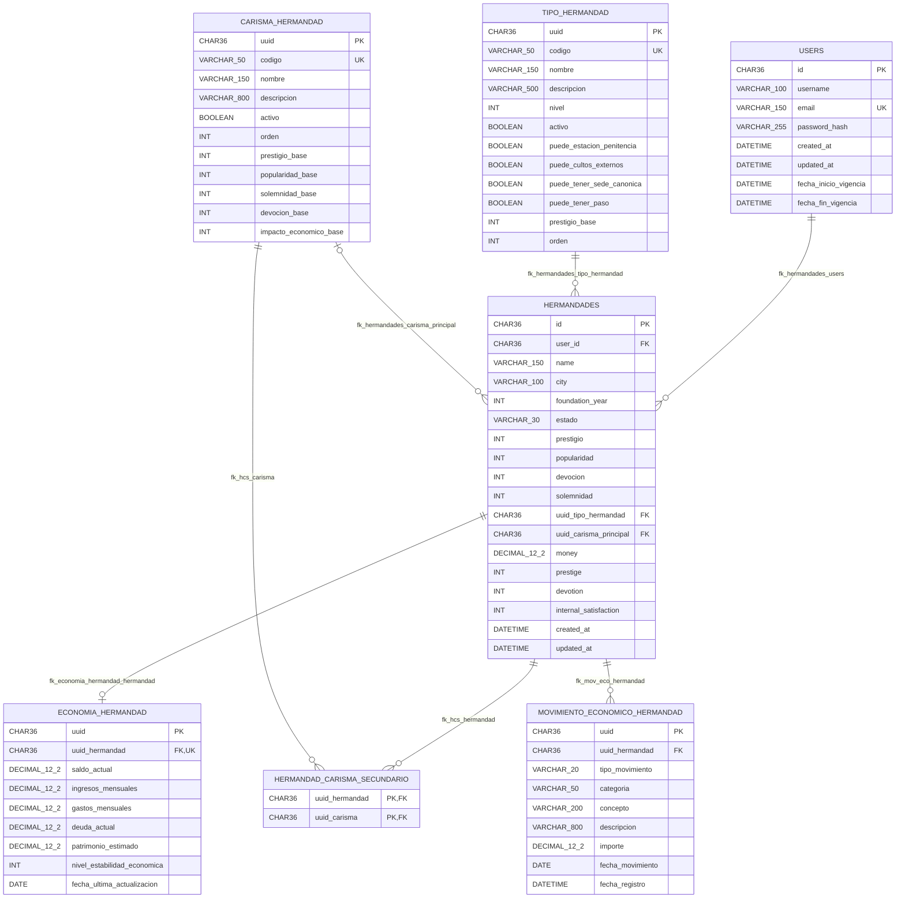

# Diagrama de entidades: gestion-usuarios y gestion-hermandades

## Relaciones

| Relacion | Cardinalidad | Clave |
| --- | --- | --- |
| `users` -> `hermandades` | Un usuario puede tener 0..N hermandades; cada hermandad pertenece a 1 usuario. | `hermandades.user_id` -> `users.id` |
| `tipo_hermandad` -> `hermandades` | Un tipo puede clasificar 0..N hermandades; cada hermandad tiene 1 tipo obligatorio. | `hermandades.uuid_tipo_hermandad` -> `tipo_hermandad.uuid` |
| `carisma_hermandad` -> `hermandades` como carisma principal | Un carisma puede ser principal en 0..N hermandades; cada hermandad puede tener 0..1 carisma principal. | `hermandades.uuid_carisma_principal` -> `carisma_hermandad.uuid` |
| `hermandades` -> `hermandad_carisma_secundario` | Una hermandad puede tener 0..N carismas secundarios. | `hermandad_carisma_secundario.uuid_hermandad` -> `hermandades.id` |
| `carisma_hermandad` -> `hermandad_carisma_secundario` | Un carisma puede aparecer como secundario en 0..N hermandades. | `hermandad_carisma_secundario.uuid_carisma` -> `carisma_hermandad.uuid` |
| `hermandades` -> `economia_hermandad` | Una hermandad puede tener 0..1 registro economico; cada economia pertenece a 1 hermandad. | `economia_hermandad.uuid_hermandad` -> `hermandades.id` |
| `hermandades` -> `movimiento_economico_hermandad` | Una hermandad puede tener 0..N movimientos economicos; cada movimiento pertenece a 1 hermandad. | `movimiento_economico_hermandad.uuid_hermandad` -> `hermandades.id` |

## Notas

- La relacion entre `hermandades` y `users` cruza los modulos: `gestion-hermandades` guarda `user_id` como `UUID`, no como asociacion JPA a `UserEntity`, pero Liquibase define la FK `fk_hermandades_users`.
- `hermandad_carisma_secundario` es la tabla intermedia de la relacion N..M entre `hermandades` y `carisma_hermandad`.
- `economia_hermandad.uuid_hermandad` tiene una restriccion unica, por eso modela una relacion 1 a 0..1 desde `hermandades`.
